# Fiddler User Manual

## 1. Welcome

*Fiddler* is a transcription aid for self-taught fiddle players, designed for learning tunes by ear from recordings. Open an audio file, slow it down without changing pitch, navigate by clicking the waveform, and build practice loops with a pre-roll countdown that gives you time to switch from the mouse to the instrument before each take.

This manual covers the version of Fiddler in your hands. The chapters that follow walk through opening audio, controlling playback, marking phrases, building loops, and reporting bugs.

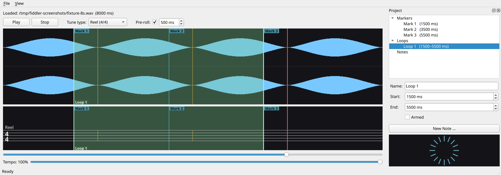

## 2. First five minutes

This chapter walks through opening a recording, slowing it down, navigating the waveform, and placing a marker so you can return to a phrase. The whole sequence takes about five minutes from a cold start.

1. **Open an audio file.** Choose **File ▸ Open** and pick any recording. Fiddler accepts MP3, FLAC, WAV, OGG, M4A, AAC, Opus, and AIFF.

2. **Drop the tempo to 70 %.** Drag the **Tempo** slider at the bottom of the window until the label reads *Tempo: 70 %*. Pitch is preserved; only the playback rate changes.

3. **Press Play.** Audio begins from the start of the recording. The vertical red cursor on the waveform tracks the current playback position.

4. **Click anywhere on the waveform to seek.** Playback jumps to where you clicked.

5. **Press M to drop a marker.** A labelled flag appears above the waveform at the playback position. The marker is named automatically and shows up in the project viewer dock on the right.

6. **Double-click the marker's row in the dock.** Playback jumps back to the marker, ready for another listen.

7. **Press Ctrl+S to save.** A dialog asks where to save the *Fiddler project* file — a `.fdlp` sidecar alongside the audio. Future opens of that `.fdlp` restore the session, marker and all.

You now have the core navigation and bookmarking gestures. The chapters that follow add tempo control, barline tapping, practice loops, and the pre-roll countdown.

## 3. The main window

The Fiddler window is divided into four working areas, stacked vertically with a side panel on the right.


- *Transport row.* Play and Stop buttons, the *Tune type* picker, and the *Pre-roll* checkbox and spinbox. The transport row stays at the top so the controls are always reachable.
- *Waveform.* A summary view of the loaded recording. Click anywhere along the waveform to seek; the red cursor tracks the current playback position.
- *Staff.* A musical staff with the time signature on the left. Barlines you place with **B** appear here, lined up with the same source-time as the waveform above.
- *Position and tempo sliders.* The position slider mirrors the playback cursor and accepts dragging for precise seeks. The tempo slider sets playback speed from 25 % to 100 %.
- *Project viewer dock.* The right-hand panel lists every marker and loop in the recording, with a property page below for renaming and re-positioning. Press **F4** to hide or show the dock.

## 4. Playing back audio

Fiddler reads any common audio format and plays it back at a tempo of your choosing without changing the pitch. The transport row across the top owns playback control.

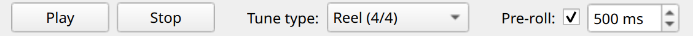

- *Play / Stop.* Press the **Play** button or the spacebar to start playback; press it again to pause. **Stop** rewinds to the beginning of the recording.
- *Tune type.* A drop-down with tradition-named time signatures (Reel, Jig, Hornpipe, and so on). Picking one updates the staff's time signature on the left of the music staff.
- *Pre-roll.* A checkbox and a duration spinbox. The pre-roll plays a short silence before each take so you have time to ready the bow. Chapter 7 covers it in detail.

### Tempo

Drag the **Tempo** slider to play back at 25 % to 100 % of the original speed. Pitch is preserved at every tempo. The slider lives at the bottom of the window so it stays close to the position slider you'll use alongside it.

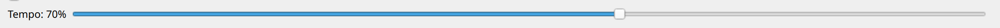

Note that the tempo change is real-time: there is no rebuild of the recording when you move the slider.

### Seeking

Click anywhere on the waveform to jump playback to that point. The position slider beneath the waveform is the same control surface in linear form: drag the handle for fine adjustments where the waveform is dense.

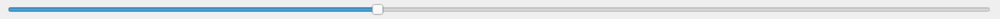

### Zoom and pan

Hold **Ctrl** and scroll the mouse wheel over the waveform or the staff to zoom in on the time axis. The point under the cursor stays put; everything else fans out around it, so you can drop the cursor on the note you're chasing and zoom straight onto it. A dashed amber line tracks the mouse while **Ctrl** is held — that line is exactly where the wheel will pivot. Hold **Shift** and scroll to pan the visible window left or right without changing the zoom.

When you're zoomed in, a horizontal scrollbar appears between the staff and the position slider — drag it to scroll along the recording, or click the arrows to nudge.

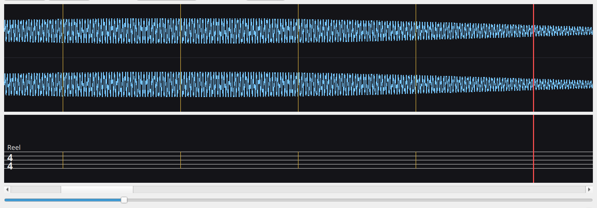

Keyboard equivalents:

| Key | Action |
|---|---|
| **Ctrl++** | Zoom in around the playback cursor |
| **Ctrl+-** | Zoom out around the playback cursor |
| **Ctrl+0** | Fit the entire recording to the window |

**View ▸ Follow Playback** keeps the visible window chasing the playback cursor: when playback reaches the right edge of the view, the window jumps forward so the cursor lands inside the new viewport with a small lead-in from the left edge — you see a moment of what just played plus most of what's coming up. Follow is on by default. Scrolling manually — by dragging the scrollbar or with **Shift+wheel** — turns Follow off so a deliberate scroll doesn't immediately bounce back. The next **Play** press, or a double-click on a marker or loop in the project viewer, re-engages Follow automatically, so an accidental nudge of the scrollbar doesn't leave Follow stuck off.

## 5. Barlines

A *barline* is a vertical line on the music staff that divides the recording into bars. You place barlines as you listen, by tapping a key in time with the music. Each barline is anchored to a source-time position; the staff renders them in order.

### Tap to place

Press **B** during playback to drop a barline at the current playback position. The barline appears on the staff immediately, and the cursor keeps moving so you can tap the next one as the bar arrives.

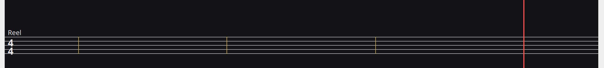

Tap-to-place is the primary gesture for adding barlines. Clicking on the waveform or the staff *seeks* — it does not place. Keep a hand on the keyboard while listening so you can tap **B** without breaking flow.

### Adjust a barline

Drag a placed barline to nudge its position. Press it on the waveform or the staff and drag horizontally; release to commit. The cursor follows the barline as you drag, so you hear where you're moving it to.

To delete a barline, click it once to select, then press **Delete**. To take back the most recent edit — a placement, a drag, a position change in the dock, a delete, or a rename — press **Ctrl+Z**.

### Tune type and time signature

The **Tune type** picker on the transport row sets the time signature shown on the staff. The presets are tradition-named — *Reel (4/4)*, *Jig (6/8)*, *Slip Jig (9/8)*, and so on — so you pick the dance form rather than the bare numerator and denominator.

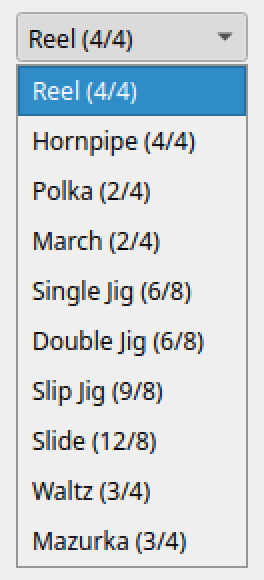

Note that Fiddler does not enforce a uniform bar length. Crooked tunes (with bars that vary in length) place freely; the time signature describes the prevailing shape rather than constraining each bar.

## 6. Markers

A *marker* is a labelled cue point in the recording. Use markers to bookmark a phrase, an ornament, or a hard passage you want to return to. Markers appear as flags above the waveform and as rows in the project viewer dock.

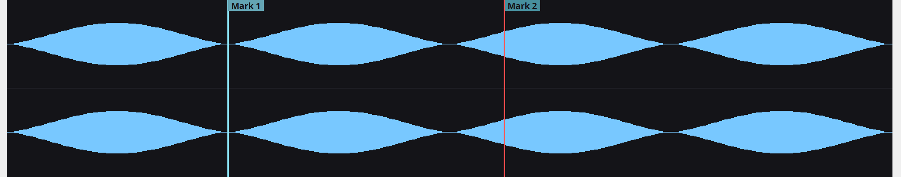

### Place a marker

Press **M** during playback to drop a marker at the current playback position. The marker is auto-named *Mark 1*, *Mark 2*, and so on, and shows up in the *Markers* category of the dock immediately.

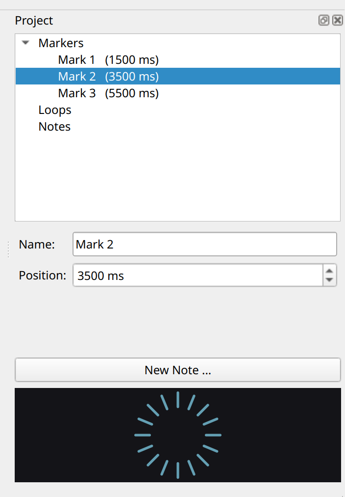

### Rename and re-position

Click a marker — on the waveform, on the staff, or in the dock — to select it. The dock's property page below the tree shows the marker's name and its position in milliseconds.

- *Name.* Edit the field and press Enter. The new name shows in the dock and on the marker's flag.
- *Position.* Edit the millisecond value and press Enter, or drag the marker tick on the waveform or the staff for finer control while listening.

### Jump and play

Double-click a marker's row in the dock to jump playback to that marker and start playing. If the pre-roll is on, you'll hear the countdown before audio resumes.

### Markers vs barlines

Markers and barlines look similar in the data model — each is anchored to a source-time position — but they serve different purposes. Use *barlines* to mark the regular pulse of the music; use *markers* to label specific moments you want to revisit. A barline says "this is where bar 3 starts"; a marker says "this is the awkward triplet."

## 7. Practice loops

A *loop* is a region of the recording that plays back repeatedly. Use loops to drill a phrase: arm the loop, press Play, and the recording wraps from the end back to the start of the loop until you stop. Combine the loop with the pre-roll and Fiddler gives you ready-set-go time before each take.

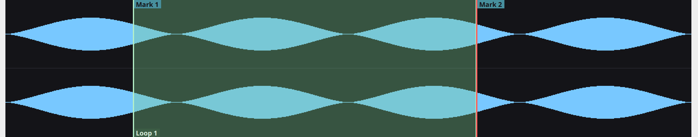

### Build a loop

A loop is built from two anchors — a *primary* anchor and a *secondary* anchor. Each anchor can be any artifact already in the recording: a barline, a marker, or another loop's edge.

1. Click an artifact to make it the primary anchor.
2. Hold **Ctrl** and click another artifact to attach it as the secondary anchor.
3. Press **L**.

A new loop spans the source-time range from the smaller of the two anchor positions to the larger. The loop appears as a translucent band across the waveform and the staff, and as a row in the *Loops* category of the dock.

### Arm and play

A loop is *armed* when its row in the dock has a play-arrow glyph and the **Armed** checkbox on the property page is checked. Only one loop is armed at a time.

- Double-click the loop's row in the dock to arm it, jump to its start, and play.
- Or click the loop's row to select it, then check **Armed** on the property page to arm it without seeking.

While a loop is armed, the recording wraps from the loop's end back to its start each time playback reaches the end. **Stop** disarms; pressing **Play** with no loop armed plays through normally.

### Adjust a loop's edges

Drag either edge of a loop band to fine-tune its boundaries. Loop edges *snap* to nearby barlines and markers when you drag within a few pixels of one, so you can pin an edge to a known anchor without typing a position.

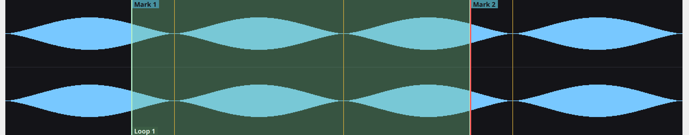

You can also edit the loop's start and end positions in the dock's property page, in milliseconds.

### Pre-roll

The *pre-roll* is a short silence inserted before audio resumes, so you have time to lift the bow and prepare. The transport row's **Pre-roll** checkbox switches it on; the spinbox sets the duration in milliseconds.

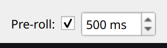

When the pre-roll is on, a circular countdown widget appears at the bottom of the project viewer dock. Each tick around the ring represents a fraction of the pre-roll; the ring depletes during the silence and refills when audio starts.


The pre-roll runs whenever playback resumes from Paused or Stopped — when you press Play, double-click a marker, or cancel and resume. Armed loops are the exception: they always play a pre-roll between repeats when pre-roll is enabled, even when playback is already running. This gives you the same ready-set-go cadence between every take.

## 8. Notes

A *note* is a region of the recording over which you perceived a single pitch — onset, offset, and which pitch was sounding. Notes appear as horizontal green bars on the staff, anchored horizontally to their time interval and vertically to their pitch.

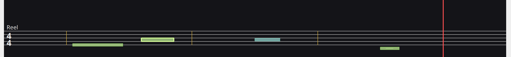

### Placing a note — two stages

Note placement is deliberately two-click. The button at the bottom of the project viewer dock changes its label to tell you which stage you're in:

| Button label | Meaning |
|---|---|
| **New Note …** | Nothing pending. Clicking begins a new note draft at the current playback position. |
| **Add Note** | A new-note draft is open. The property page above shows its defaults; edit them, then click to commit the note to the staff. |
| **Apply Changes to Note** | You're editing an existing note (selected from the Notes list). The property page reflects a *buffered* copy; click to apply your edits to the stored note, or click outside to discard. |

The two-stage flow:

1. **Seek** to the region you want to transcribe (click the waveform or staff).
2. Click **New Note …** — the property page populates with the defaults (Start/End = playback ± 200 ms, Pitch = A4). No note is on the staff yet.
3. Adjust the **Pitch** (and the interval / duration if needed). Pitch is entered in Scientific Pitch Notation: `A4`, `F5`, `C4`. Lowercase letters work and the field renders the canonical uppercase form after Enter. Naturals only in this build — `C#4` or `Bb3` are silently rejected.
4. Click **Add Note** — the bar now appears on the staff.

Clicking the waveform or anywhere outside a note while a draft is open *discards the draft* and the button label resets to **New Note …**.

### Editing an existing note

Click a note's row in the Notes list. The property page shows its current values and the button changes to **Apply Changes to Note**. Edits buffer in the property page; nothing is written back until you click the button. Clicking the waveform / another row instead discards the buffered changes.

### Property page fields

- *Pitch* — Scientific Pitch Notation. Naturals (`A4`, `C5`, `G3`) and **accidentals** (`F#4`, `A#5`, `Bb3`) are both accepted. The dock normalises flat input to sharp spelling — type `Bb4` and the field shows `A#4` (the enharmonic) on commit. The `(MIDI N)` label beside the field is the equivalent MIDI number. Accepted range is the violin's playable span: **G3 (open G string) to E7** — anything outside silently reverts to the previous valid value. Accidentals share the staff line of their natural-below (an A♯4 sits on the A4 space) but are rendered in a **cooler, teal-shifted green** so they're visually distinct from naturals. This matches the piano-roll convention every major DAW uses (Logic, Pro Tools, Ableton, FL Studio, Cubase…): no per-note ♯ glyph on the bar — pitch identity is conveyed by row + colour.
- *Start* and *End* — interval boundaries in milliseconds. Each is clamped relative to the other so the interval stays valid (End ≥ Start + 1).
- *Duration* — read-only, derived from `End − Start`.

Notes outside the treble staff paint with short *ledger lines* at every line position between the note and the staff body — middle C below the staff, A5 above, and so on. The staff is tall enough to show the full violin range with the necessary ledger lines on both sides.

### Notes vs barlines, markers, loops

| | Anchor | What it represents |
|---|---|---|
| **Barline** | one source-time stamp | structural beat boundary |
| **Marker** | one named source-time stamp | a cue point in your practice |
| **Loop** | a named source-time range | a region you want to drill |
| **Note** | a source-time range *and* a pitch | a perceived note in the tune |

Notes are the only artifact that carries a pitch. **Delete** removes the selected note exactly like it removes the other artifact kinds; **Ctrl+Z** brings it back with its original interval and pitch.

> *What's next.* The dock button is the foundation gesture. The follow-up step adds mouse-hover preview on the staff with an optional reference-tone synth so you can match a note's pitch to the recording by ear before committing it.

## 9. The project viewer dock

The dock on the right of the window lists every marker, loop, and note in the recording, with a property page below the tree for editing the selected artifact.

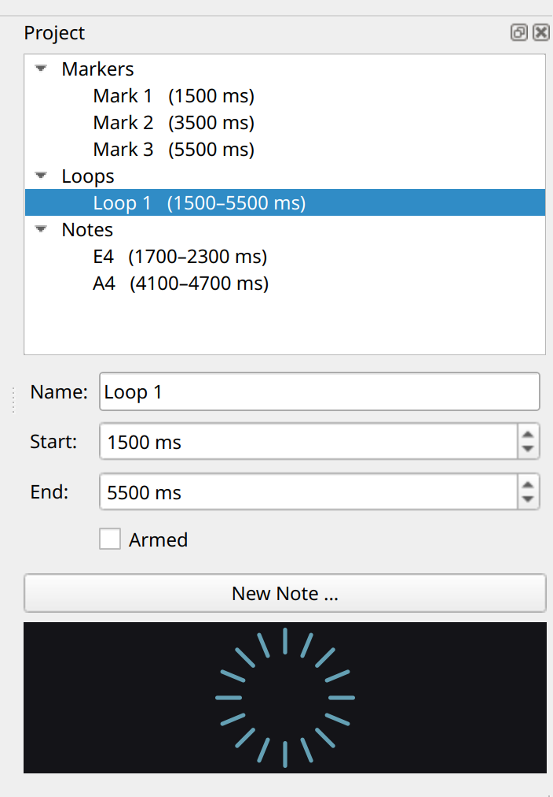

- *Tree.* Markers, Loops, and Notes as three collapsible categories. Click a row to select; double-click a row to jump and play.
- *Property page.* Shows the fields of the currently-selected artifact. Markers expose Name and Position; loops expose Name, Start, End, and the Armed checkbox; notes expose Pitch, Start, End, and Duration (no per-note name — notes are anonymous, matching MuseScore / MusicXML conventions).
- *Note button.* Below the property page — its label cycles among **New Note …**, **Add Note**, and **Apply Changes to Note** depending on what the dock is showing. See *§8 Notes* for the workflow.
- *Pre-roll countdown.* When the pre-roll is enabled, the countdown ring appears at the bottom of the dock and animates during each pre-roll silence.

Press **F4** to hide or show the dock. The dock's visibility persists across sessions, so a hidden dock stays hidden until you press **F4** again.

## 10. Saving, opening, and undo

### Save and reopen

A *Fiddler project* is the audio file path plus everything you've placed on top of it — barlines, markers, loops, the chosen tune type, and the pre-roll setting. Projects are saved as `.fdlp` files alongside the audio.

- **File ▸ Save** (**Ctrl+S**) — saves the project. If the session hasn't been saved before, this opens the Save As dialog.
- **File ▸ Save As…** (**Ctrl+Shift+S**) — picks a new path. Default suggestion is the audio file's name with a `.fdlp` extension.
- **File ▸ Open…** (**Ctrl+O**) — opens an audio file *or* a `.fdlp` project. The file dialog filter shows both kinds.

### Open Recent

**File ▸ Open Recent** lists the ten most-recently-opened files — both audio and `.fdlp` projects — in most-recent-first order. Picking an entry opens it the same way the file dialog would; the entry then jumps to the front of the list. If the file has moved or been deleted since you last opened it, you'll see a *File not found* dialog and the entry drops off the list automatically.

The submenu is dimmed when nothing has been opened yet. **Clear Recent Files** at the bottom empties the list.

When a project is loaded, the window title shows its filename: *Fiddler — tune.fdlp*. An asterisk in front of the title — *\* Fiddler — tune.fdlp* — means the session has unsaved changes. Save with **Ctrl+S** to clear the asterisk.

Note that closing the window with unsaved changes prompts you to save first; pick *Discard* to lose the changes, *Cancel* to keep the window open.

### Undo

Press **Ctrl+Z** to reverse the most recent edit. The undo history covers every kind of action across barlines, markers, loops, and notes, in the order you took them: placements, drags, dock spinbox edits, pitch edits, renames, and deletes. Pre-roll changes — both the duration spinbox and the enable checkbox — are covered too. A deleted artifact returns with the same name and the same position (or interval and pitch) it had before.

Repeated **Ctrl+Z** presses walk back through the history one step at a time. When the history drains, further presses are quiet no-ops. Redo (**Ctrl+Shift+Z**) is on the roadmap.

Note that the undo history resets when you load a project: **Ctrl+Z** does not reach across a Open call.

## 11. Keyboard shortcuts

| Key | Action | Where |
|---|---|---|
| **Space** | Play / Pause | anywhere |
| **B** | Place barline at playback position | anywhere |
| **M** | Place marker at playback position | anywhere |
| **L** | Create a loop from the primary and secondary anchors | anywhere |
| **Ctrl+click** | Attach a secondary anchor for loop creation | waveform, staff, dock |
| **Click** | Select an artifact, or seek if no artifact is hit | waveform, staff |
| **Drag** | Move a marker tick or a loop edge | waveform, staff |
| **Double-click** | Jump and play a marker; jump, arm, and play a loop | dock |
| **Delete** | Remove the selected artifact | anywhere |
| **Ctrl+O** | Open an audio file or a Fiddler project | anywhere |
| **Ctrl+S** | Save the current project | anywhere |
| **Ctrl+Shift+S** | Save the current project to a new path | anywhere |
| **Ctrl+Z** | Undo the most recent edit (placement, drag, dock edit, rename, or delete) | anywhere |
| **Ctrl++** | Zoom in around the playback cursor | anywhere |
| **Ctrl+-** | Zoom out around the playback cursor | anywhere |
| **Ctrl+0** | Fit the entire recording to the window | anywhere |
| **Ctrl+wheel** | Zoom in / out around the mouse position | waveform, staff |
| **Shift+wheel** | Pan the visible window horizontally | waveform, staff |
| **F4** | Show / hide the project viewer dock | anywhere |
| **Esc** | Clear the current selection | waveform, staff |
| **← / →** | Step through artifacts of the same kind | waveform, staff |

## 12. Reporting bugs

If something goes wrong, re-run Fiddler with the structured event log enabled and attach the resulting file to your bug report.

```bash
./build/src/fiddler \
    --log-filter='ui.*,player,waveform,score' \
    --log-file=/tmp/fiddler.log
```

Every user-driven action — file open, play, pause, seek, tempo change, tap-to-place, secondary-anchor, create-loop, loop-armed, loop-wrap, drag commit, undo, select, delete, time-signature pick, close — emits a single line capturing the verb, its parameters, and the resulting model state. The log lets the maintainers replay your session and reproduce the bug deterministically.

Note that the log captures gestures and state, not audio content. The recording you had open is not embedded in the log.

## 13. Glossary

*Anchor*. A source-time position that serves as one endpoint of a loop. The primary anchor is the currently-selected artifact; the secondary anchor is set by Ctrl+clicking another artifact. Pressing **L** creates a loop spanning both.

*Barline*. A vertical line on the staff that marks the start of a bar. Tap **B** during playback to place one at the playback position.

*Crooked tune*. A tune whose bars vary in length. Fiddler permits crooked-tune transcription by anchoring barlines to source-time rather than to a uniform bar grid.

*Loop*. A region of the recording, bounded by two source-time positions, that plays back repeatedly while armed.

*Marker*. A labelled cue point in the recording. Tap **M** during playback to drop one at the playback position.

*Note*. A labelled region of the recording paired with a perceived pitch. Added via the dock's Add Note button. Pitches are written in SPN (e.g., *A4*, *F5*) and restricted to naturals — sharps and flats arrive with the key-signature feature later.

*SPN*. *Scientific Pitch Notation* — the standard letter+octave spelling for a pitch (*A4* = the A above middle C). Used throughout Fiddler's Pitch fields. *C4* is middle C.

*Pre-roll*. A short silence inserted before audio resumes, giving you time to ready the bow. Set the duration in the transport row's Pre-roll spinbox.

*Project*. The audio file plus everything you've placed on top of it — barlines, markers, loops, tune type, pre-roll setting. Saved as a `.fdlp` sidecar next to the audio with **Ctrl+S**.

*Tap to place*. Pressing **B** or **M** during playback to add a barline or marker at the current playback position. The primary placement gesture; clicks on the waveform or staff seek rather than place.

*Tune type*. A tradition-named preset that picks a time signature for the staff (Reel = 4/4, Jig = 6/8, and so on).
